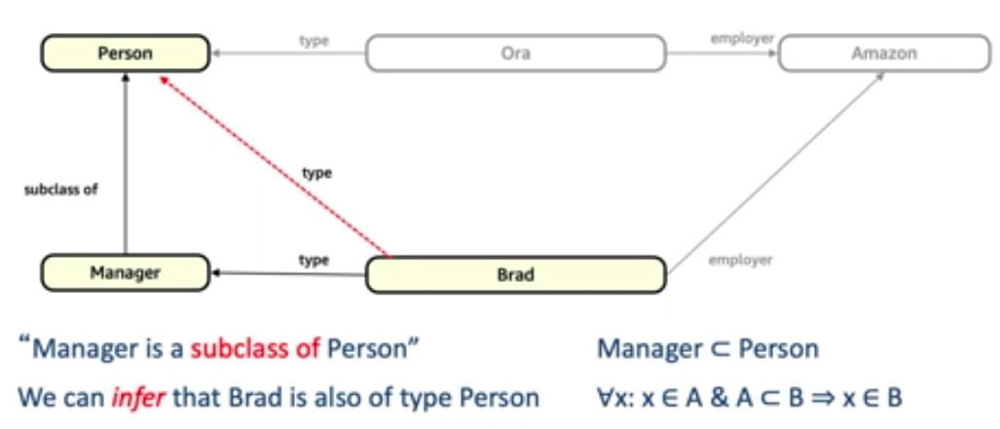

#### What is Graphs?

Graphs are a very natural way to think about information and especially about the representation of our world 

Graphs consist of nodes and edges

* Edges connect vertices (nodes)
* Every edge has a direction and a label
* Queries are expressed as traversal from vertex to vertex via edges

##### <U>RDF Graph:-</U>

An `RDF graph` is a `directed, labeled (DLG)` 
  * Works in a sort of Object oriented passion, so we can introduce a class `type`
  * Polymorphism and reasoning
        
  * We can infer the data from existing node/Vertices
  * Nodes & Edges are named using URIs for machine readability  
  
#### Property Graph