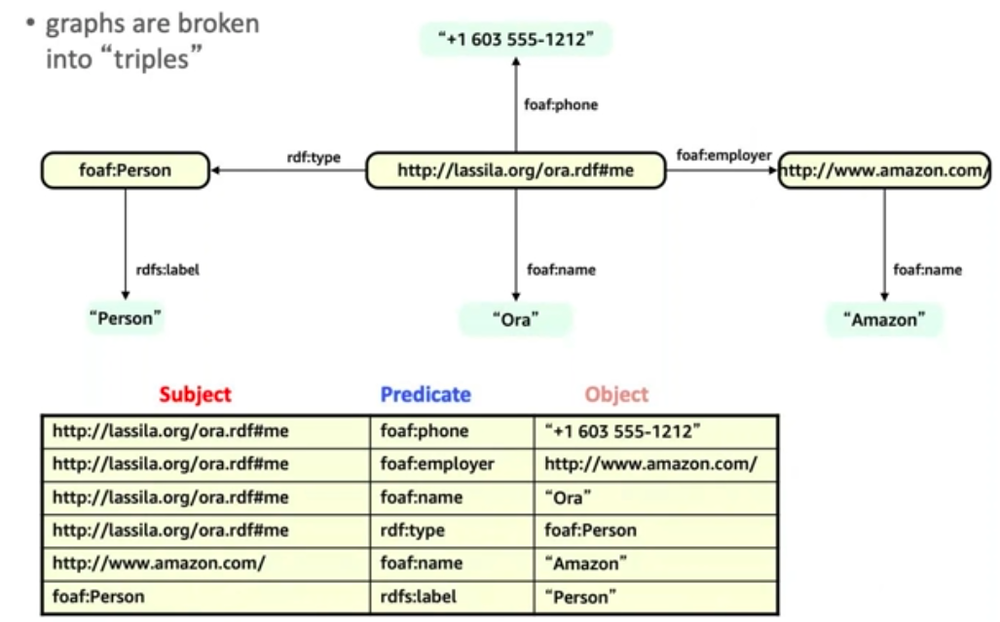

#### What is Graphs?

Graphs are a very natural way to think about information and especially about the representation of our world 

Graphs consist of nodes[Vertices] and edges.

##### Vertices - Domain Entities (things, events, concepts)
 * Label - type (Eg: Person, product)
 * Properties - attribute or metadata (Eg: name, price)
  
##### Edges - relationship

 * Label - semantic/relationship type
 * Properties - attribute or metadata (Eg: strength, weight, quality, metadata)

####  How it works?

* Edges connect vertices (nodes)
* Every edge has a direction and a label
* Queries are expressed as traversal from vertex to vertex via edges

##### <U>RDF Graph:-</U>

RDF graph in some way it's a pure graph, it has nothing but vertices and edges.  
An `RDF graph` is a `directed, labeled (DLG)` 
  * Works in a sort of Object oriented passion, so we can introduce a class `type`
  * Polymorphism and reasoning
        
  * We can infer the data from existing node/Vertices
  * Nodes & Edges are named using `URIs or IRI` for machine readability  
        * `XML Qualified name [QName]` is used for label
  * RDF storage
    
  ###### Literals
  
  * In RDF, `Everything is an edge`, and therefore triples may have scalar values in the object position; these scalar values are called `Literals`.
  * Literals cannot be used in the subject position of triples.
  * Literals may have a `Datatype[XSD primitive datatypes are used]` or language `en`
  * Ex: `"database"@en-IN`
  
  ###### Named Graph
  
  * RDF data in the database can be divided into multiple subgraph
    * one subgraph with no name called the `default graph`
    * `0...n` subgraphs with a name
  * Any resource can be used as a graph name
    * no denotational semantics, it's merely an identifier
  * An RDF dataset is a collection of named graph + default graph
  
 ##### Benefits of using RDF
 * RDF and semantic web technologies are practically well suited to problems where 
    * we need to interoperability, data needs to be shared and reused
    * complexity of data model is high
    * data is heterogeneous (e.g., many different models)
 * Traditionally, we have seen many successful applications in fields such as 
    * Pharmaceuticals & life science (complex data that need to be shared)
    * e-government(many heterogeneous data)
    * digital libraries, museum collections (integration therefore)
 
    

       
 
#### Property Graph

##### Query 
<u>Germil:-</u> 
 * imperative traversal language
 * Apache Open source