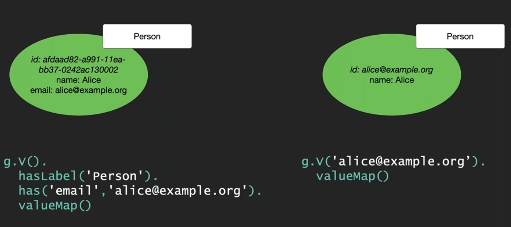
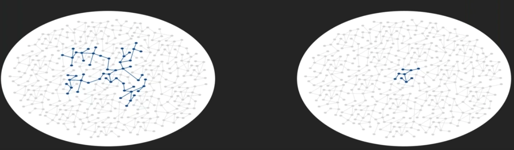
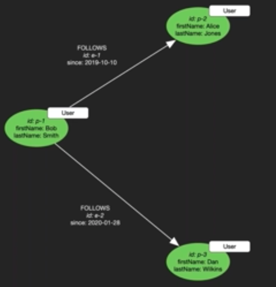

1. #### Use meaningful IDs for vertices and edges
    

2. #### Edges - the route to success

   `Performance` depends on how much of graph query `traverse`.
Choose domain-meaningful edge labels that help
   * `Discover` only what is absolutely required
   * `Avoid` traversing unnecessary portion of the graph
   
  
3. #### Model to favour outgoing edges in traversal

   Design your `model` so that your `performance-critic queries` follow mostly `outgoing edges`

   When traversing `incoming edges`, always specify the `edge label` as part of query

     * Use ``` in('CREATED'), inE('CREATED'), both('CREATED') rather than in(), inE() and both()```
     * Consider enabling the `OSGP[object subject graph predicate] index` if you traverse lot of incoming edges.
  
4. #### Limit the number of distinct predicates

   Keep the number of distinct `edge labels`, `edge` and `vertex` property names in low 1000's
      
   
   In the above example,
   
   ``` User, Follows, FirstName & LastName``` are the distinct predicates
   
   Consider enabling `OSGP` index, if you create large number of distinct predicates
   
 